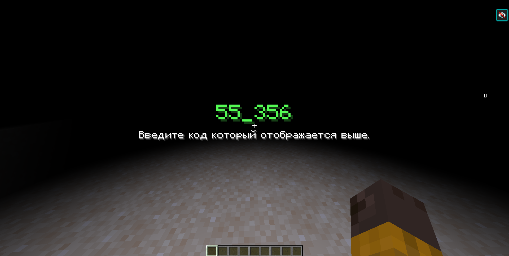
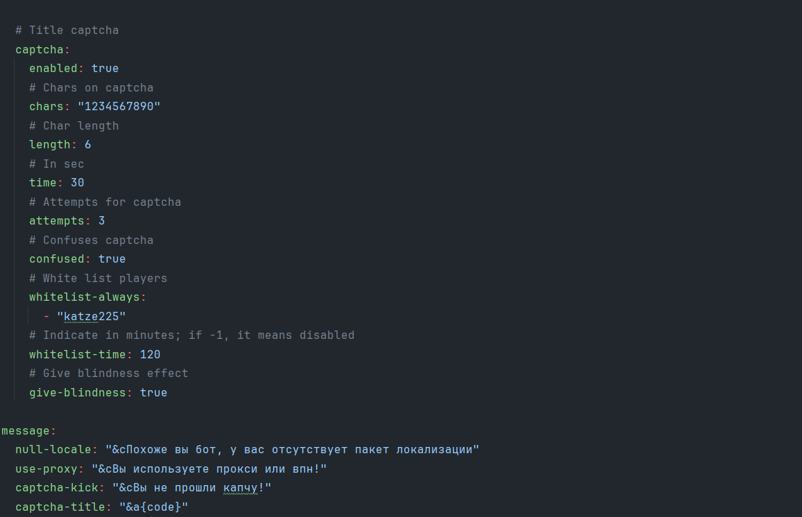

## 🛡️ Katze-AntiBot 
### Features

- Easy to use.
- High performance.
- Best protection.

### Usage
`Add the .jar file to the plugins folder and start your server.`

### Dependencies
- Paper 1.16.5+
- PlaceholderAPI 2.11.6+ (additionally)

### Commands
- /katze-antibot stats - View plugin stats
### Permissions
- katze-antibot.bypass - Bypasses all checks
- katze-antibot.admin - Gives access to /katze-antibot command

### Placeholders
- %katze-antibot_code% - Return the captcha code
### Screenshots
- 
- 
### License
See the [LICENSE](LICENSE.md) file for license rights and limitations.

##### :ghost: [by Katze](https://github.com/katze225 "by Katze")
